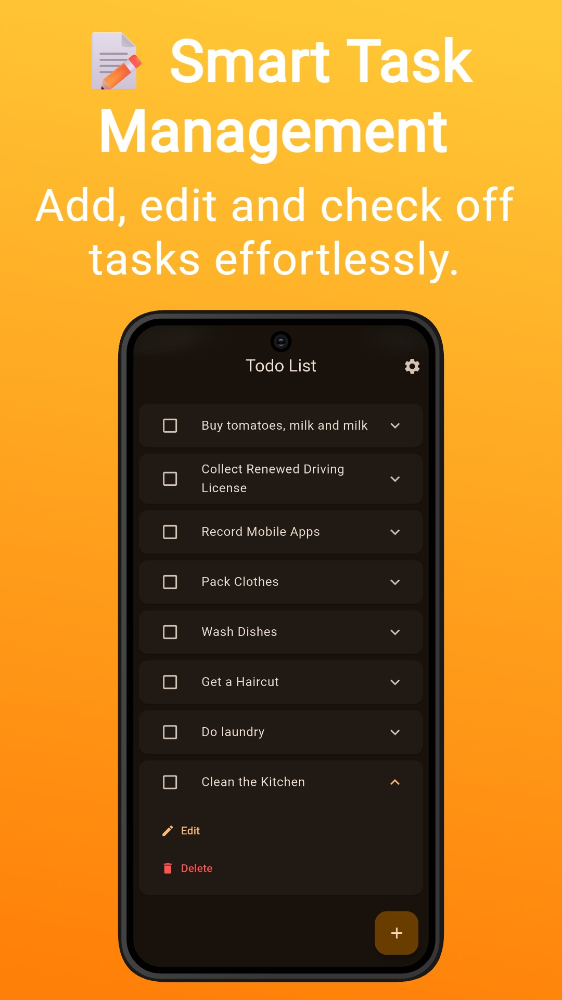
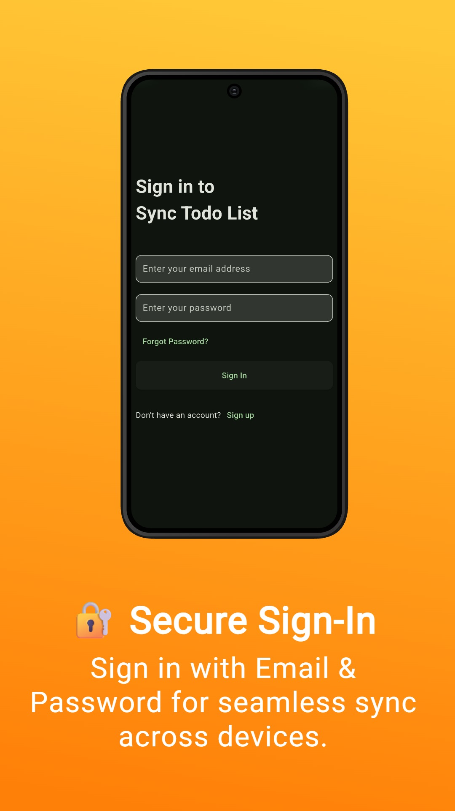
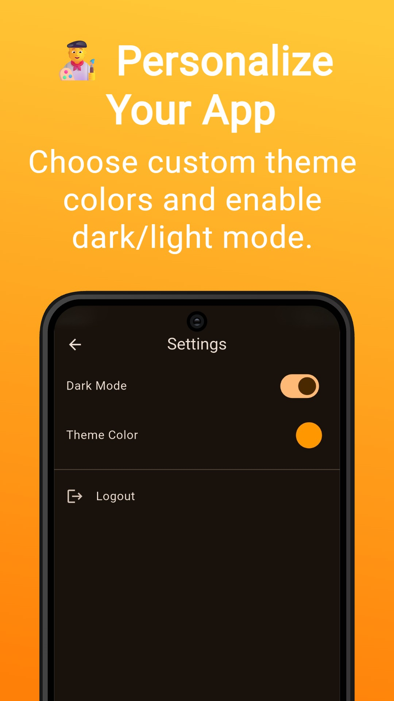
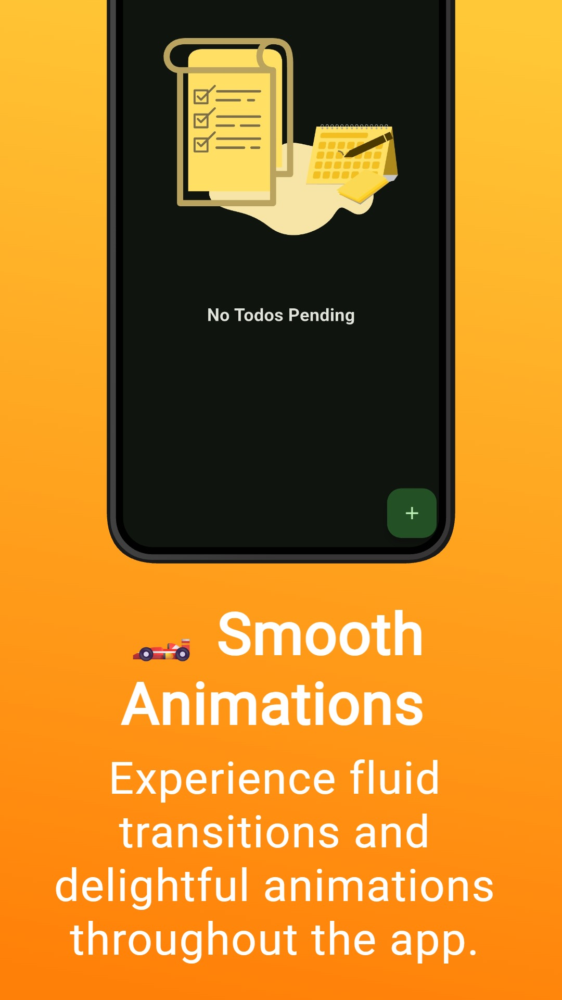
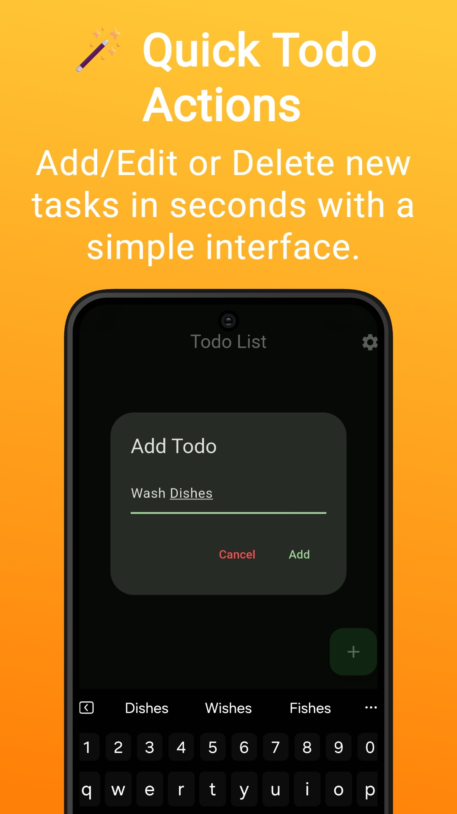
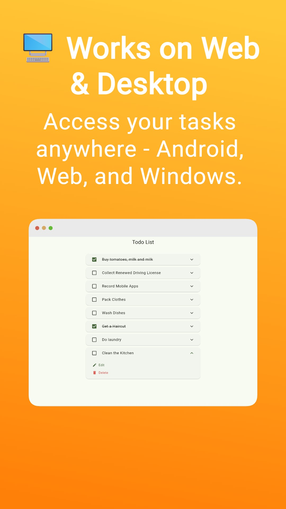

# 📝 Todo List

Todo List is a simple cross-platform Todo App Built using Flutter and Firebase, designed to keep you productive on Android, Web, and Windows. The app is responsive, follows Material3 guidelines and is rich with animations.

Please star⭐ the repo if you like what you see😊.

## 💻 Installation and Usage

<table>
  <tr>
    <th>Platform</th>
    <th>Installation Links</th>
  </tr>
  <tr>
    <td>Android</td>
    <td>
      
       
      
       
      
    </td>
  </tr>
  <tr>
      <td>Windows</td>
      <td>
        
      </td>
  </tr>

  <tr>
      <td>Web App</td>
      <td>
        
      </td>
  </tr>
</table>

## ✨ Features

- ✅ Add, Edit & Delete Todos
- ✅ Offline-First Sync Across Multiple Devices
- ✅ Online Sync with Firebase
- ✅ Email & Password Authentication
- ✅ Dark & Light Modes
- ✅ Dynamic Primary Color Themes
- ✅ Responsive Design (Android, Web, Windows)
- ✅ Material 3 UI
- ✅ Smooth Add/Delete Animations

## 📽️ Screen Recording

## 📸 Screenshots
     

## 🔌 Plugins

| Name                                                                  | Usage                                                                  |
|-----------------------------------------------------------------------|------------------------------------------------------------------------|
| [**cloud_firestore**](https://pub.dev/packages/cloud_firestore)       | For Firestore Database                                                 |
| [**firebase_auth**](https://pub.dev/packages/firebase_auth)           | For Device Authentication                                              |
| [**firebase_core**](https://pub.dev/packages/firebase_core)           | For Firebase Libraries                                                 |
| [**flutter_riverpod**](https://pub.dev/packages/flutter_riverpod)     | For State Management                                                   |
| [**go_router**](https://pub.dev/packages/go_router)                   | To Handle Routing and Navigation                                       |
| [**lottie**](https://pub.dev/packages/lottie)                         | To Display Animations                                                  |
| [**shared_preferences**](https://pub.dev/packages/shared_preferences) | To Store User Settings Preferences                                     |
| [**flutter_lints**](https://pub.dev/packages/flutter_lints)           | Contains a recommended set of lints to encourage good coding practices |

## 🤓 Author

**[Aditya R](https://github.com/adeeteya)**

## 🔖 LICENSE
Copyright (c) 2023 **[Aditya R](https://github.com/adeeteya)**
[MIT LICENSE](https://github.com/adeeteya/FlutterTodoList/blob/master/LICENSE)

## 🙏 Attributions
<a href="https://www.flaticon.com/free-icons/to-do-list" title="to do list icons">To do list icons created by Freepik - Flaticon</a>
