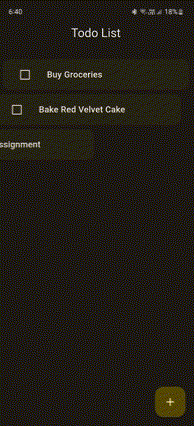
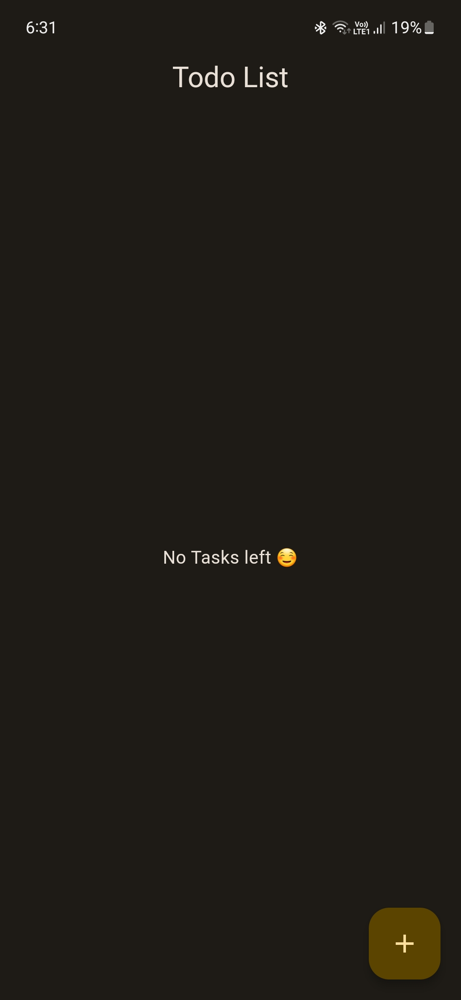
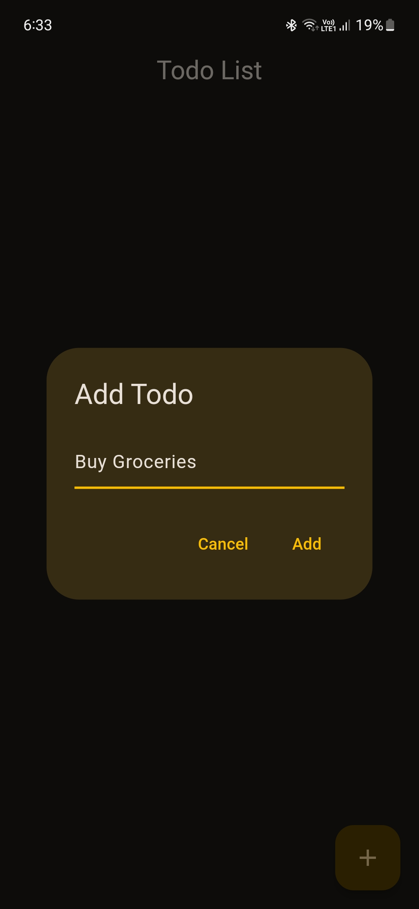
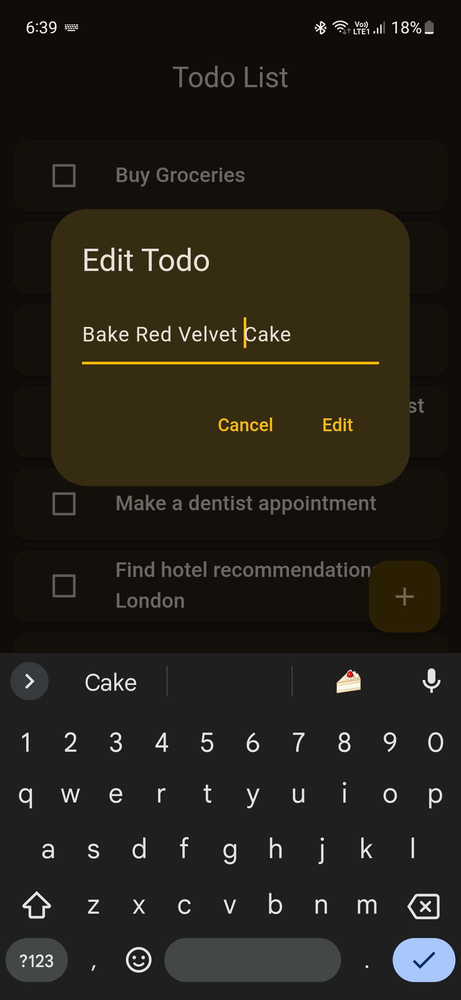
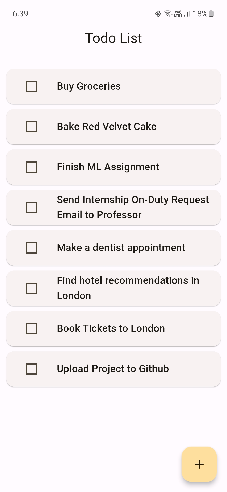

# 📝 Todo List

Todo List is a simple cross-platform Todo App Built using Flutter and Isar Database.
The app is responsive, follows Material3 guidelines and is rich with animations.

Please star⭐ the repo if you like what you see😊.

## 💻 Installation and Usage

### Android

### Windows

## ✨ Features

- [x] Add Todo
- [x] Edit Todo
- [x] Delete Todo
- [x] Add and Delete Animations
- [x] Dark and Light Modes
- [x] Responsive Design
- [x] Material 3 Design

## 📸 Screenshots
     

## 🔌 Plugins

| Name | Usage |
| - | - |
| [**isar**](https://pub.dev/packages/isar) | NoSQL Database to store todos |
| [**isar_flutter_libs**](https://pub.dev/packages/isar_flutter_libs) | Flutter binaries for the Isar Database |
| [**isar_generator**](https://pub.dev/packages/isar_generator) | Code generator for the Isar Database |
| [**build_runner**](https://pub.dev/packages/build_runner) | Code generator to generate dart files |
| [**flutter_lints**](https://pub.dev/packages/flutter_lints) | Contains a recommended set of lints to encourage good coding practices |

## 🤓 Author

**[Aditya R](https://github.com/adityar224)**

## 🔖 LICENSE
Copyright (c) 2022 **[Aditya R](https://github.com/adityar224)**
[MIT LICENSE](https://github.com/adityar224/FlutterTodoList/blob/master/LICENSE)

## 🙏 Attributions
<a href="https://www.flaticon.com/free-icons/to-do-list" title="to do list icons">To do list icons created by Freepik - Flaticon</a>